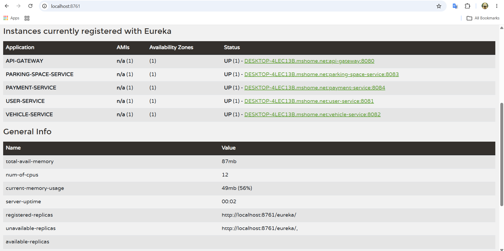

# Smart Parking Management System (SPMS)

A cloud-native, microservices-based Smart Parking Management System built with Spring Boot and Spring Cloud (Eureka Service Registry, Config Server, API Gateway) for the **ITS 1018 - Software Architectures & Design Patterns II** Final Examination Assignment.

---

## 🏛️ System Architecture

The project follows a distributed microservices architecture where all business services communicate through the API Gateway and register with the Eureka Discovery Server.

* **Service Registry (Eureka Server):** `http://localhost:8761`
* **Config Server:** `http://localhost:8888`
* **API Gateway:** `http://localhost:8080`
* **User Service:** `http://localhost:8081`
* **Vehicle Service:** `http://localhost:8082`
* **Parking Space Service:** `http://localhost:8083`
* **Payment Service:** `http://localhost:8084`

---

## 🛠️ Tech Stack

* **Language:** Java 21
* **Framework:** Spring Boot
* **Cloud Components:** Spring Cloud Netflix Eureka, Spring Cloud Gateway, Spring Cloud Config
* **Database & Persistence:** MySQL, Spring Data JPA, Hibernate
* **Build Tool:** Apache Maven

---

## 🚀 How to Run

To run the complete system locally, start the components in the following sequence:

1. **Service Registry (`service-registry`):**
   * Start first to enable service discovery.
   * Access dashboard at `http://localhost:8761`.

2. **Config Server (`config-server`):**
   * Start second to serve centralized configurations to all downstream services.

3. **Core Business Microservices:**
   * Start `user-service`
   * Start `vehicle-service`
   * Start `parking-space-service`
   * Start `payment-service`

4. **API Gateway (`api-gateway`):**
   * Start last to route external requests to registered discovery instances.

5. **Verification:**
   * Open `http://localhost:8761` in your browser to confirm all microservices are registered and showing status `UP`.

---

## 📑 Submission & Resources

* [Postman Collection](./postman_collection.json)
* 
